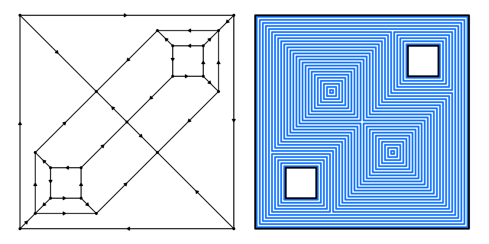
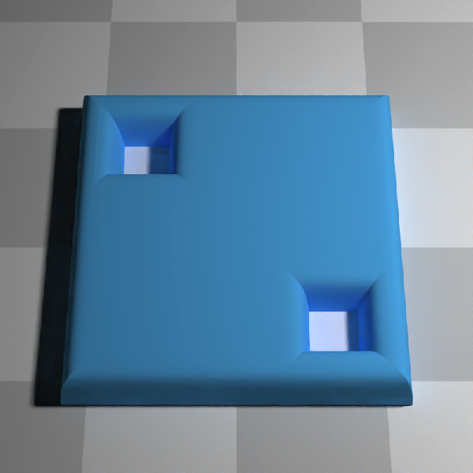
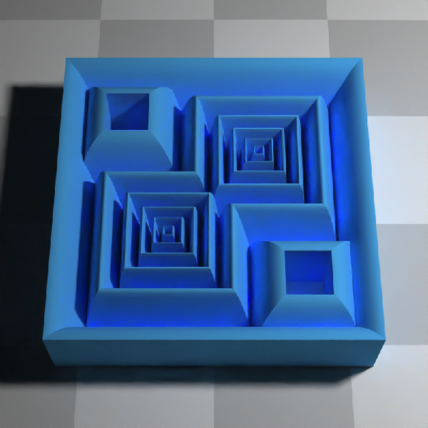
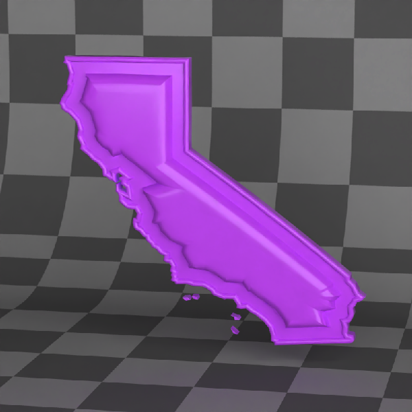

<!-- README.md is generated from README.Rmd. Please edit that file -->

# raybevel: 3D Bevels and Straight Skeletons in R


<!-- badges: start -->

[](https://github.com/tylermorganwall/raybevel/actions/workflows/R-CMD-check.yaml)
<!-- badges: end -->

`raybevel` is an R package that can create and visualize straight
skeletons, generate offset polygons, and generate 3D roof models and 3D
beveled polygons. The 3D beveled polygons can be given any arbitrary 1D
bevel profile controlled by the user.

## Background

Straight skeletons are geometric objects obtained by shrinking polygon
boundaries at a uniform speed. These skeletons have a variety of
applications, such as:

- Offsetting polygons: Creating inner margins for a given polygon.
- Roof designs: Generating planar straight-line drawings that represent
  the roof of a structure.
- Beveling: Designing roof structures with sloping sides.

`raybevel` generates straight skeletons from polygons and uses these
structures to generate 3D meshes and offset polygons.

## Features

- **Skeleton Generation**: Create straight skeletons from polygons, with
  or without holes. Supports raw polygons and {sf} objects.

- **Polygon Offsetting**: Generate inset polygons.

- **3D Roof Generation and 3D Beveling**: Create and visualize simple
  and complex beveled roofs based on straight skeletons.

- **Visualization**: Plot straight skeletons and offset polygons.

## Installation

`raybevel` can be installed from Github:

``` r
install.packages("remotes")
remotes::install_github("tylermorganwall/raybevel")
library(spData)
```

## Examples

First, let’s load the library and generate a polygon with holes.

``` r
library(raybevel)
# Define a simple polygon
vertices = matrix(c(0, 0, 7, 0, 7, 7, 0, 7, 0, 0), ncol = 2, byrow = TRUE) - 3.5
# Holes inside the polygon
hole_1 = matrix(c(1, 1, 2, 1, 2, 2, 1, 2, 1, 1), ncol = 2, byrow = TRUE)[5:1, ] - 3.5
hole_2 = matrix(c(5, 5, 6, 5, 6, 6, 5, 6, 5, 5), ncol = 2, byrow = TRUE)[5:1, ] - 3.5
plot.new()
par(mai = c(0, 0, 0, 0))
plot(vertices, type = "n", xlim = c(-4, 4), ylim = c(-4, 4), xlab = "", ylab = "",
     xaxt = 'n', yaxt = 'n', frame.plot = FALSE, asp = 1)
polygon(vertices, col = "lightblue")
polygon(hole_1, col = "white")
polygon(hole_2, col = "white")
```


``` r
dev.off()
#> null device 
#>           1
```

Generate the straight skeleton. This plots arrows indicating the
directionality of the links, which either point up-roof or along
constant distance contours.

``` r
skeleton = skeletonize(vertices, holes = list(hole_1, hole_2))
plot_skeleton(skeleton)
```


Now, we can offset this polygon inwards:

``` r
offset_polygon = generate_offset_polygon(skeleton, offset = 1.2)
offset_polygon
#> $`1`
#>      x    y
#> 1  2.3 -2.3
#> 2  2.3  0.3
#> 3  0.3  0.3
#> 4  0.3  2.3
#> 5 -2.3  2.3
#> 6 -2.3 -0.3
#> 7 -0.3 -0.3
#> 8 -0.3 -2.3
plot_offset_polygon(offset_polygon, skeleton = skeleton)
```


We can also plot multiple offsets and use color palettes.

``` r
library(patchwork)
offset_polygon = generate_offset_polygon(skeleton, offset = seq(0, 2.5, by = 0.1))
plot_skeleton(skeleton, arrow_color = "black", polygon_color = "black") + 
plot_offset_polygon(offset_polygon, skeleton = skeleton, plot_original_polygon = TRUE)
```



Let’s design a simple roof and render it with rayrender. When
base_height is less than the roof offset (default of 0), the sides of
the polygon will also be extruded.

``` r
library(rayrender)
#> 
#> Attaching package: 'rayrender'
#> The following object is masked from 'package:raybevel':
#> 
#>     run_documentation
library(rayvertex)
#> 
#> Attaching package: 'rayvertex'
#> The following object is masked from 'package:rayrender':
#> 
#>     r_obj

roof = generate_roof(skeleton)  

generate_ground(depth = -0.5, material = diffuse(color = "grey", checkercolor = "white")) |>
  add_object(raymesh_model(roof, material = diffuse(color = "dodgerblue"))) |>
  add_object(sphere(y = 20, x = 0, z = -10, material = light(intensity = 200))) |> 
  render_scene(lookfrom = c(10, 20, 0), sample_method = "sobol_blue", fov = 25, 
               min_variance = 1e-6, clamp_value = 10, samples = 256, width = 800, height = 800)
```


And here is a beveled roof (here, setting the base height to the level
of the ground, which generates the sides of the polygon as well):

``` r
roof_bevel = generate_beveled_polygon(skeleton, base = TRUE, base_height = -0.5,
                                      bevel_offsets = generate_bevel("circular", max_height = 0.5,
                                                                      bevel_end = 0.5),)

generate_ground(depth = -0.5, material = diffuse(color = "grey", checkercolor = "white")) |>
  add_object(raymesh_model(roof_bevel, material = diffuse(color = "dodgerblue"), override_material = TRUE)) |>
  add_object(sphere(y = 15, x = 0, z = -10, material = light(intensity = 200))) |> 
  render_scene(lookfrom = c(10, 20, 0), sample_method = "sobol_blue", fov = 25, 
               min_variance = 1e-6, clamp_value = 10, samples = 256, width = 800, height = 800)
```


Multiple bevels are also supported (here, we use raw distance offsets,
rather than percentage):

``` r
roof_bevel_multi = generate_beveled_polygon(skeleton, 
                                            bevel_offsets = c(0.25, 0.5, 1, 1.5, 2),
                                            bevel_heights = c(0.25, 0.25, 0.5, 0.5, 0.75),
                                            raw_offsets = TRUE, base = TRUE, base_height = -0.5) 

generate_ground(depth = -0.5, material = diffuse(color = "grey", checkercolor = "white")) |>
  add_object(raymesh_model(roof_bevel_multi, material = diffuse(color = "dodgerblue"), override_material = TRUE)) |>
  add_object(sphere(y = 15, x = 0, z = -10, material = light(intensity = 200))) |> 
  render_scene(lookfrom = c(10, 20, 0), sample_method = "sobol_blue", fov = 25, 
               min_variance = 1e-6, clamp_value = 10, samples = 256, width = 800, height = 800)
```


You can use this to generate smooth variations in roof height:

``` r
roof_bevel_multi = generate_beveled_polygon(skeleton, base_height = -0.5,
                                            bevel_offsets = seq(0, 2.5, by = 0.02),
                                            bevel_heights = 1 - exp(-seq(0, 2.5, by = 0.02) * 10),
                                            raw_heights = TRUE,
                                            raw_offsets = TRUE) 

generate_ground(depth = -0.5, material = diffuse(color = "grey", checkercolor = "white")) |>
  add_object(raymesh_model(roof_bevel_multi, material = diffuse(color = "dodgerblue"), override_material = TRUE)) |>
  add_object(sphere(y = 15, x = 0, z = -10, material = light(intensity = 200))) |> 
  render_scene(lookfrom = c(10, 20, 0), sample_method = "sobol_blue", fov = 25,
               min_variance = 1e-6, clamp_value = 10, samples = 256, width = 800, height = 800)
```



And you can specify more complex functions for bevel height as well:

``` r
roof_bevel_multi_sin = generate_beveled_polygon(skeleton, 
                                                bevel_offsets = seq(0,2.5,by=0.02),
                                                bevel_heights = abs(sinpi(exp(seq(0,2.5,by=0.02))/2))/2,
                                                base = TRUE, offset=0.5, base_height = -0.5,
                                                raw_offsets = TRUE) 

generate_ground(depth = -0.5,material = diffuse(color="grey", checkercolor = "white")) |>
  add_object(raymesh_model(roof_bevel_multi_sin, material = diffuse(color="dodgerblue"), override_material = TRUE)) |>
  add_object(sphere(y=15,x=0,z=-10,material=light(intensity = 200))) |> 
  render_scene(lookfrom=c(10,20,0), sample_method = "sobol_blue",fov=25, ortho_dimensions = c(8,8),
               min_variance = 1e-6, clamp_value = 10, samples=256, width=800,height=800)
```



You can also plot {sf} objects. Here, we generate a roof in the shape of
California.

``` r
library(rayvertex)
library(sf) 

# Load US states data and extract California
us_states = spData::us_states
california = us_states[us_states$NAME == "California",]
cali_skeleton = skeletonize(california)  # Skeletonize the California shape

# Generate and transform the roof model
roof_cali = generate_roof(cali_skeleton, base = TRUE, sides = TRUE, offset = 1, base_height = 0,
                          angle = 30) |> 
  center_mesh() |> 
  translate_mesh(c(0,1,0)) 

# Render the scene with the California roof model
generate_ground(depth = -0.1, material = diffuse(color="grey50", checkercolor = "white", checkerperiod = 0.5)) |>
  add_object(raymesh_model(roof_cali, material = diffuse(color = "purple"), override_material = TRUE)) |>
  add_object(sphere(y=20, x=20, z=-50, radius=10, material=light(color="white", intensity = 20))) |>
  add_object(sphere(y=20, x=30, z=50, radius=10, material=light(color="orange", intensity = 20))) |>
  render_scene(lookfrom=c(0,10,-5), camera_up=c(0,0,1), lookat=c(0,0,0.25),
               sample_method = "sobol_blue", fov=0, ortho_dimensions = c(12,12),
               min_variance = 0, clamp_value = 10, samples=256, width=800, height=800)
```


We can also generate a complex beveled polygon with
`generate_beveled_polygon()`. We’ll first generate and plot our more
complex bevel:

``` r
bevel = generate_complex_bevel(c("bump", "exp"),
                               bevel_start = c(0,0.3),
                               bevel_end = c(0.1,0.6),
                               reverse = c(F,F),
                               segment_height = c(0.05,0.2),
                               plot_bevel = TRUE) 
```


Now let’s create a vertically-oriented (by turning `swap_yz = FALSE` 3D
polygon of California and render it as a glossy, double-sided model.

``` r
ca_model = generate_beveled_polygon(cali_skeleton, offset = 0.2, sides = TRUE, double_sided = TRUE,
                                    bevel_offsets = bevel, swap_yz = FALSE, 
                                    material = rayvertex::material_list(diffuse = "purple"))

# Rendering the 3D model
ca_model |>
  rayvertex::center_mesh() |>
  raymesh_model(y = 1.5, material = glossy(color = "purple", gloss = 0.8)) |>
  add_object(generate_studio(depth = -4, distance = -15,
                             material = diffuse(color = "grey50", checkercolor = "grey20"))) |>
  add_object(xy_rect(y = 15, x = 5, z = 60, xwidth = 100, ywidth = 50,
                     flipped = TRUE, angle = c(0, 45, 0),
                     material = light(intensity = 3))) |>
  render_scene(lookfrom = c(10, 10, 50), lookat = c(0, 1.5, 1),
               sample_method = "sobol_blue", samples = 256, clamp_value = 10,
               width = 800, height = 800, fov = 15, ortho_dimensions = c(10, 10))
```


