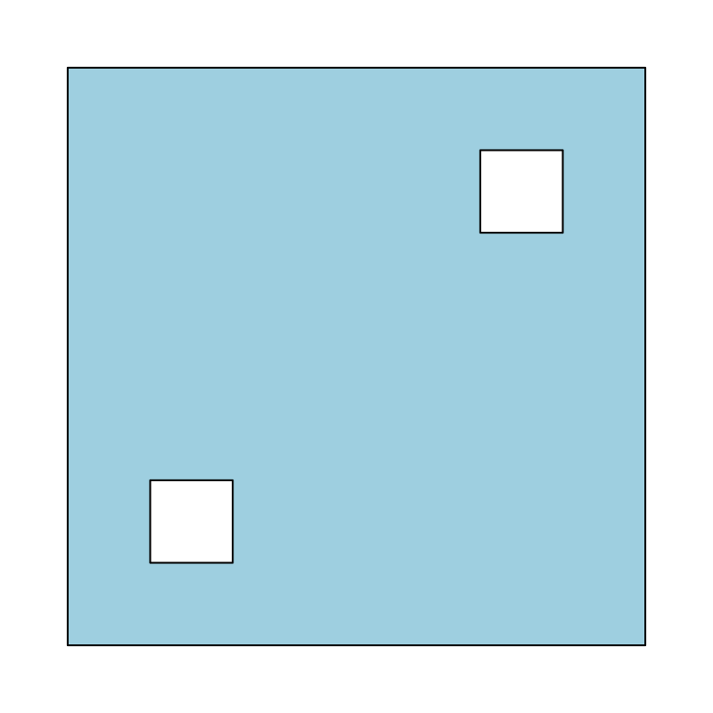
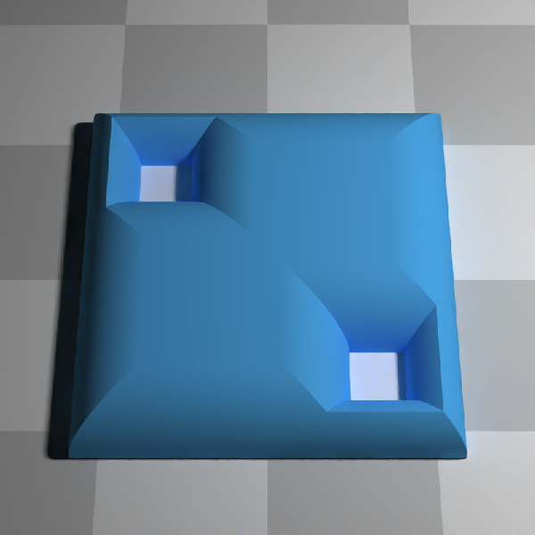

<!-- README.md is generated from README.Rmd. Please edit that file -->

# rayskeleton

<!-- badges: start -->

[](https://github.com/tylermorganwall/rayskeleton/actions/workflows/R-CMD-check.yaml)
<!-- badges: end -->

rayskeleton: Straight Skeletons and Their Applications

=========================================================

`rayskeleton` is an R package offering capabilities to create and
visualize straight skeletons, generate offset polygons, and generate 3D
roof models (both full and beveled).

## Background

Straight skeletons are geometric objects obtained by shrinking polygon
boundaries at a uniform speed. These skeletons have a variety of
applications, such as:

- Offsetting polygons: Creating inner or outer margins for a given
  polygon.
- Roof designs: Generating planar straight-line drawings that represent
  the roof of a structure.
- Beveling: Designing roof structures with sloping sides.

## Features

- **Skeleton Generation**: Create straight skeletons from polygons, with
  or without holes. Supports raw polygons and {sf} objects.

- **Polygon Offsetting**: Generate inset polygons.

- **Roof Designs**: Create and visualize simple and beveled roofs based
  on straight skeletons.

- **Visualization**: Plot straight skeletons and offset polygons.

## Installation

`rayskeleton` can be installed from Github:

``` r
install.packages("remotes")
remotes::install_github("tylermorganwall/rayskeleton")
```

## Examples

First, let’s load the library and generate a polygon with holes.

``` r
library(rayskeleton)
#Define a simple polygon
vertices = matrix(c(0,0, 7,0, 7,7, 0,7, 0,0), ncol = 2, byrow = TRUE)
# Holes inside the polygon
hole_1 = matrix(c(1,1, 2,1, 2,2, 1,2, 1,1), ncol = 2, byrow = TRUE)[5:1,]
hole_2 = matrix(c(5,5, 6,5, 6,6, 5,6, 5,5), ncol = 2, byrow = TRUE)[5:1,]
plot.new()
plot(vertices, type="n", xlim=c(-1,8), ylim=c(-1,8), xlab="", ylab="",
     xaxt='n', yaxt='n', frame.plot = FALSE, asp = 1)
polygon(vertices,col="lightblue")
polygon(hole_1,col="white")
polygon(hole_2,col="white")
```



``` r
dev.off()
#> null device 
#>           1
```

Generate the straight skeleton. This plots arrows indicating the
directionality of the links, which either point up-roof or along
constant distance contours.

``` r
skeleton = skeletonize(vertices, holes = list(hole_1,hole_2))
plot_skeleton(skeleton)
```


Now, we can offset this polygon inwards:

``` r
offset_polygon = generate_offset_polygon(skeleton, offset = 1.2)
offset_polygon
#> $`1`
#>     x   y
#> 1 3.2 1.2
#> 2 5.8 1.2
#> 3 5.8 3.8
#> 4 3.8 3.8
#> 5 3.8 5.8
#> 6 1.2 5.8
#> 7 1.2 3.2
#> 8 3.2 3.2
plot_offset_polygon(offset_polygon, skeleton = skeleton)
```


We can also plot multiple offsets and use color palettes.

``` r
offset_polygon = generate_offset_polygon(skeleton, offset = seq(0,2.5,by=0.1))
plot.new()
plot_offset_polygon(offset_polygon,skeleton = skeleton, palette_border = heat.colors, linewidth = 4)
plot_skeleton(skeleton, add=TRUE, arrow_color = "black", polygon_color = "black")
```


Let’s design a simple roof and render it with rayrender.

``` r
library(rayrender)
library(rayvertex)

roof = generate_roof(skeleton, swap_yz = TRUE, max_height = 5) |> 
  translate_mesh(c(-3.5,0,-3.5))

generate_ground(depth = -0.2,material = diffuse(color="grey")) |>
  add_object(raymesh_model(roof, material = diffuse(color="dodgerblue"), override_material = TRUE)) |>
  add_object(sphere(y=20,x=0,z=-10,material=light(intensity = 100))) |> 
  render_scene(lookfrom=c(10,10,0), sample_method = "sobol_blue",fov=0, ortho_dimensions = c(8,8),
               min_variance = 1e-6, clamp_value = 10, samples=128, width=800,height=800)
```


And here is a beveled roof:

``` r
roof_bevel = generate_roof_beveled(skeleton, bevel_offsets = 0.25,
                             swap_yz = TRUE, bevel_heights = 0.25) |> 
  translate_mesh(c(-3.5,0,-3.5))

generate_ground(depth = -0.2,material = diffuse(color="grey")) |>
  add_object(raymesh_model(roof_bevel, material = diffuse(color="dodgerblue"), override_material = TRUE)) |>
  add_object(sphere(y=20,x=0,z=-10,material=light(intensity = 100))) |> 
  render_scene(lookfrom=c(10,10,0), sample_method = "sobol_blue",fov=0, ortho_dimensions = c(8,8),
               min_variance = 1e-6, clamp_value = 10, samples=128, width=800,height=800)
```



Multiple bevels are also supported:

``` r
roof_bevel_multi = generate_roof_beveled(skeleton, bevel_offsets = c(0.25,0.5,1,1.5,2),
                             swap_yz = TRUE, bevel_heights = c(0.25,0.25,0.5,0.5,0.75)*2) |> 
  translate_mesh(c(-3.5,0,-3.5))

generate_ground(depth = -0.2,material = diffuse(color="grey")) |>
  add_object(raymesh_model(roof_bevel_multi, material = diffuse(color="dodgerblue"), override_material = TRUE)) |>
  add_object(sphere(y=5,x=0,z=-10,material=light(intensity = 100))) |> 
  render_scene(lookfrom=c(10,10,0), sample_method = "sobol_blue",fov=0, ortho_dimensions = c(8,8),
               min_variance = 1e-6, clamp_value = 10, samples=128, width=800,height=800)
```


You can use this to generate smooth variations in roof height:

``` r
roof_bevel_multi = generate_roof_beveled(skeleton, bevel_offsets = seq(0,2.5,by=0.02),
                             swap_yz = TRUE, bevel_heights = sqrt(seq(0,2.5,by=0.02))) |> 
  translate_mesh(c(-3.5,0,-3.5))

generate_ground(depth = -0.2,material = diffuse(color="grey")) |>
  add_object(raymesh_model(roof_bevel_multi, material = diffuse(color="dodgerblue"), override_material = TRUE)) |>
  add_object(sphere(y=5,x=0,z=-10,material=light(intensity = 100))) |> 
  render_scene(lookfrom=c(10,10,0), sample_method = "sobol_blue",fov=0, ortho_dimensions = c(8,8),
               min_variance = 1e-6, clamp_value = 10, samples=128, width=800,height=800)
```


And you can specify more complex functions for bevel height as well:

``` r
roof_bevel_multi_sin = generate_roof_beveled(skeleton, bevel_offsets = seq(0,2.5,by=0.02),
                             swap_yz = TRUE, bevel_heights = abs(sinpi(seq(0,2.5,by=0.02))/5)) |> 
  translate_mesh(c(-3.5,0,-3.5))

generate_ground(depth = -0.2,material = diffuse(color="grey")) |>
  add_object(raymesh_model(roof_bevel_multi_sin, material = diffuse(color="dodgerblue"), override_material = TRUE)) |>
  add_object(sphere(y=5,x=0,z=-10,material=light(intensity = 100))) |> 
  render_scene(lookfrom=c(10,10,0), sample_method = "sobol_blue",fov=0, ortho_dimensions = c(8,8),
               min_variance = 1e-6, clamp_value = 10, samples=128, width=800,height=800)
```


